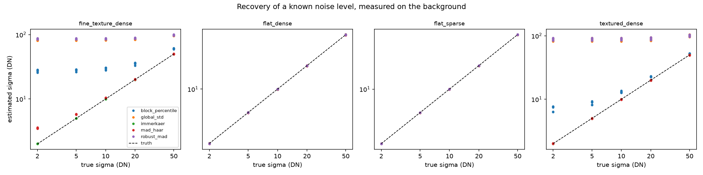
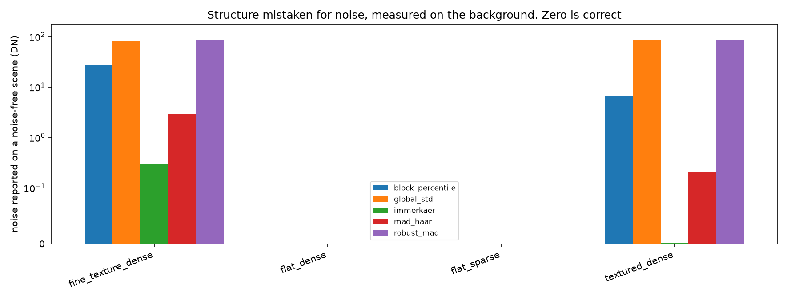

# SNR and contrast measurement for testbed bead images

Measures how much noise is in an image of the wheel-and-beads testbed, how well the beads
stand out from the surface, and how precisely a bead's position can be measured. Built so
that several noise estimation methods can be run on the same images and compared, because
which one suits the testbed was an open question.

## Specs

The request, as given: a script to compute SNR on images from a testbed that measures how
a wheel displaces beads. The testbed is preparation for the MMX mission, whose IDEFIX
rover will drive on Phobos in very low gravity, so the image processing developed here is
meant to carry over to flight data. Several SNR methods exist, it is not known which fits
the testbed, so it must be easy to run several on the same images and compare them.

Four things were not specified, and were asked before any code was written. The answers:

| Question | Answer |
| --- | --- |
| What decision should the number drive? | Whether an image is good enough to track beads; characterising the camera; flight-representative preprocessing |
| What image data will exist? | Single frames and moving sequences only. No repeated static frames, no dark or flat fields |
| What counts as "signal"? | The beads against their background |
| Format | 16-bit TIFF or raw, linear |

### One part of the scope is blocked, and why

Characterising the camera in the proper sense, meaning gain, read noise, dynamic range,
means running the EMVA 1288 photon transfer procedure, and that needs dark frames and a
series of flat fields at increasing illumination. Those were explicitly not available.

The code for it is written and tested ([camera.py](camera.py)), and the exact capture
procedure is in [Characterising the camera](#characterising-the-camera-not-possible-yet)
below. It sits unused until someone shoots about twenty extra frames, which takes maybe
fifteen minutes at the testbed. Everything else in this tool runs on the images you
already have.

There is a second consequence worth stating plainly. Without repeated frames of a static
scene, noise cannot be *measured*, only *inferred* from a single frame. Every method here
therefore has to guess which variation in the image is noise and which is the surface
itself, and every one of them can get that wrong. If the testbed can be persuaded to sit
still for five frames, that removes the guesswork entirely and is worth more than any
choice of method. See [Known limits](#known-limits).

## What gets reported, and which number to look at

"SNR" names at least three different ratios in the literature and they are not
interchangeable. This tool reports all of them, plus one more, so nobody has to guess
which definition was used.

| Column | What it is | When to use it |
| --- | --- | --- |
| `sigma_dn` | the noise, in digital numbers | comparing against the camera's read noise |
| `snr` | bead brightness over noise | comparison with datasheets only, see below |
| `cnr` | bead-to-background contrast over noise, per pixel | whether a bead is visible at all |
| `rose_index` | the same contrast, integrated over one whole bead | whether a bead can be **detected** |
| `displacement_precision_px` | best possible precision on a bead's position | whether a bead can be **tracked** |

`snr` is reported for completeness and should not drive decisions. Adding a constant to
every pixel, which is what a black level offset does, raises the signal without raising
the noise, so `snr` can be made to look good by miscalibrating the sensor. `cnr` is
immune to that.

**For this testbed, `displacement_precision_px` is the number that matters.** Detection
and displacement measurement are different problems, and detection is much the easier one.
A bead twelve pixels across stays comfortably detectable long after its motion has become
too noisy to measure. In the worked example below, two frames both come back "detectable"
while their position precision differs by a factor of ten.

The `rose_index` verdict uses the Rose criterion: an object needs an integrated
signal-to-noise of roughly 3 to 5 before an observer reliably sees it. Below 3 is reported
as not detectable, 3 to 5 as marginal, 5 and above as detectable.

`displacement_precision_px` is the Cramer-Rao lower bound for estimating a translation
under additive noise, which is the standard result behind digital image correlation. It is
a **lower bound**: real correlation software does worse, typically by a factor of two or
more once interpolation, bead rotation and partial occlusion are accounted for. Treat it
as the best case the image physically allows, not as a prediction of your tracker.

## Quick start

```bash
uv sync

# Measure every method on some frames.
uv run python -m processing.snr.run analyse frames/*.tif --out results

# If the testbed is lit unevenly, remove the gradient before finding the beads.
uv run python -m processing.snr.run analyse frames/*.tif --flatten-sigma-px 25

# If Otsu picks the wrong regions, pick them by hand instead: row,col,height,width
uv run python -m processing.snr.run analyse frame.tif \
    --rect-signal 100,100,40,40 --rect-background 300,300,80,80

# Re-run the validation that produced the tables further down.
uv run python -m processing.snr.run benchmark --out validation
```

`--out` writes `results.csv`, a `notes.md` holding the warnings, and a bar chart comparing
the methods.

### Worked example

Two synthetic frames of the same packed, textured, unevenly lit bead field, one with 8 DN
of noise and one with 90 DN. Trimmed to the background region, which is the one to read:

```
run01_good.tif  (512x512)
  591 beads, mean area 115 px, threshold 2281 DN
  WARNING: 44% of the frame is bead/background boundary, so the beads are small or
           densely packed relative to the erosion width
  region      method             sigma DN     CNR     Rose  px precision  verdict
  background  immerkaer              7.99    75.7    813.1         0.006  detectable
  background  mad_haar               8.15    74.2    796.7         0.006  detectable
  background  block_percentile      11.08    54.6    586.5         0.008  detectable
  background  global_std            82.31     7.4     78.9         0.073  detectable
  background  robust_mad            85.99     7.0     75.6         0.078  detectable
  spread between methods: 31.28x
  the methods disagree by more than 2x, so at least one assumption is broken here

run02_noisy.tif  (512x512)
  region      method             sigma DN     CNR     Rose  px precision  verdict
  background  immerkaer             89.82     6.8     73.5         0.063  detectable
  background  mad_haar              89.70     6.8     73.6         0.063  detectable
  background  block_percentile      90.73     6.7     72.8         0.064  detectable
  background  global_std           121.31     5.0     54.4         0.108  detectable
  background  robust_mad           121.57     5.0     54.3         0.108  detectable
  spread between methods: 2.96x
```

Three things to take from this.

The verdict column says "detectable" for both, which is true and useless. The precision
column separates them by a factor of ten, which is the answer you wanted.

On the good frame the methods disagree by 31x. `global_std` and `robust_mad` report 82 and
86 DN when the truth is 8. They are measuring the surface texture, not the noise. That
disagreement is the tool working: it is a signal that the frame breaks somebody's
assumptions, and the run refuses to average it away.

On the noisy frame the spread drops to 3x, because the noise is now larger than the
texture and even the naive methods are mostly measuring noise. Methods agreeing does not
mean the image is good.

## The five methods

All five take a region of an image and return a noise standard deviation in DN. They are
run twice, once over a background region that segmentation has kept clear of the beads,
and once over the whole frame. The gap between the two says how much scene structure each
method absorbed.

| Method | How it works | Breaks when |
| --- | --- | --- |
| `global_std` | standard deviation of the region | the region is not perfectly uniform. Kept as a baseline to beat |
| `robust_mad` | median absolute deviation of the pixel values | more than about half the region is structure |
| `immerkaer` | mean absolute response to a 3x3 Laplacian | the mean makes it sensitive to a few strong edges |
| `mad_haar` | median absolute deviation of the finest wavelet detail band | most 2x2 blocks straddle an edge |
| `block_percentile` | bias-corrected 10th percentile of 8x8 block standard deviations | no 8x8 block is free of structure |

Two design points worth knowing.

`immerkaer` and `mad_haar` are **exactly** immune to a lighting gradient, not
approximately. The Laplacian of a plane is zero and so is the diagonal Haar detail of a
plane, so a linear brightness ramp contributes nothing at all. `block_percentile` has no
such property: it reads whatever spread a block contains, and a gradient adds to that.
Measured in [test_snr_estimators.py](test_snr_estimators.py), a ramp of 1.95 DN per pixel
against a sigma of 5 gives a 30% over-estimate. The rule of thumb is to keep the gradient
across one 8-pixel block under about a third of sigma, or use `--flatten-sigma-px`.

`block_percentile` carries a bias correction most implementations omit. The 10th
percentile of a set of noise-only block standard deviations sits below the true sigma, by
a factor that is the 10th percentile of a chi distribution with 63 degrees of freedom, or
about 0.88. Dividing it back out makes the estimator unbiased on pure noise. The
correction is exact when every block is noise-free and slightly over-corrects otherwise,
which the benchmark measures.

## How this was validated

There is no way to check a noise estimator on real testbed data, because on a real frame
nobody knows the right answer. So the validation builds synthetic scenes, adds a known
amount of noise, and checks what comes back. Run it yourself with
`uv run python -m processing.snr.run benchmark --out validation`.

### The scenes

The scenes matter as much as the estimators. On a perfectly flat background every method
returns the right answer and the comparison tells you nothing, which is what a first pass
at this produced. Real regolith has surface texture and the testbed is lit from one side,
so both are in the test.

| Scene | Bead coverage | Surface | Lighting |
| --- | --- | --- | --- |
| `flat_sparse` | 2% | perfectly flat | even |
| `flat_dense` | 26% | perfectly flat | even |
| `textured_dense` | 26% | 60 DN of texture, 8 px grain | 200 DN ramp |
| `fine_texture_dense` | 26% | 60 DN of texture, 2 px grain | 200 DN ramp |

Bead contrast is 600 DN throughout. Beads are placed by rejection sampling so they never
overlap, which keeps the true bead area exactly pi r squared and lets the Rose index be
checked against arithmetic. Five random seeds per scene, noise from 2 to 50 DN, both
additive Gaussian and Poisson shot noise.

`fine_texture_dense` is deliberately close to impossible. Its surface grain sits at the
same spatial scale as the noise, and nothing that looks at a single frame can separate the
two. It is in the test to show where the whole approach runs out, not to be passed.

### Accuracy: recovering a known noise level

Relative error on the background region, worst case over five seeds and five noise levels.
Full numbers in [validation/scores.csv](validation/scores.csv).

| Method | flat_sparse | flat_dense | textured_dense | fine_texture_dense |
| --- | --- | --- | --- | --- |
| `immerkaer` | 0.7% | 1.0% | 1.0% | **1.5%** |
| `mad_haar` | 0.9% | 1.4% | 1.6% | 80% |
| `block_percentile` | 0.3% | 0.8% | 286% | 1327% |
| `global_std` | 0.3% | 0.5% | 4501% | 4147% |
| `robust_mad` | 0.4% | 0.6% | 4524% | 4293% |



`mad_haar`'s 80% is not a general failure. Broken down by noise level on that scene, it is
77% at sigma 2 DN, 15% at 5 DN, 4% at 10 DN and under 1% above that. It only breaks when
the noise is much smaller than a 60 DN pixel-scale grain, which is the one case where the
question itself is close to unanswerable.

Results with Poisson shot noise rather than Gaussian are in the same file and are very
similar. `immerkaer` stays under 1.3% everywhere.

### Texture bias: what each method reports on a scene with no noise at all

The correct answer is zero. Anything else is structure the method could not tell apart
from noise. Values in DN, against a bead contrast of 600 DN.

| Method | flat_sparse | flat_dense | textured_dense | fine_texture_dense |
| --- | --- | --- | --- | --- |
| `immerkaer` | 0.0 | 0.0 | 0.0 | **0.3** |
| `mad_haar` | 0.0 | 0.0 | 0.2 | 2.9 |
| `block_percentile` | 0.0 | 0.0 | 6.7 | 27.3 |
| `global_std` | 0.0 | 0.0 | 85.5 | 82.0 |
| `robust_mad` | 0.0 | 0.0 | 88.2 | 85.7 |



This is the decisive table. `global_std` on a textured surface invents 85 DN of noise that
does not exist, which is more than ten times the real noise in a well exposed frame. Any
CNR computed from it is wrong by the same factor.

### Region finding

A perfect noise estimate on top of the wrong regions still gives the wrong answer, so
segmentation is validated too, against the disks that were drawn. Intersection over union
with ground truth, averaged over noise levels and seeds:

| Scene | Otsu alone | Otsu after flattening |
| --- | --- | --- |
| `flat_sparse` | 1.00 | 1.00 |
| `flat_dense` | 1.00 | 1.00 |
| `textured_dense` | 0.95 | 0.98 |
| `fine_texture_dense` | 0.95 | 0.98 |

Bead area comes back within 3.4% of the truth, which matters because the Rose index uses
it. Segmentation holds up to 50 DN of noise, where IoU is still 0.96, so it degrades much
more gracefully than the naive noise estimators do.

### Unit tests

165 tests, about one second, run in CI and pre-commit. The ones that carry real weight:

- **Photon transfer against a simulated sensor** whose gain, read noise and offset we
  chose. If the gain were inverted or a factor of two were wrong, this catches it. It also
  checks that a gamma-corrected series fails loudly rather than returning a plausible
  number, since feeding in the wrong files is the likeliest mistake.
- **Immerkaer against its published formula**, computed pixel by pixel in the test, so the
  constant is checked and not just the behaviour.
- **The flight blur width measured by FFT** rather than recomputed from the algebra that
  produced it. This found a real bug, see [Decisions](#decisions-and-tradeoffs).
- **Poisson noise variance equals its mean**, so the shot noise generator is what it says.
- **A ramp defeats `global_std` but not `immerkaer`**, the counter-example that justifies
  having five methods instead of one.

## Which method to use

**Use `immerkaer`, measured on the background region, and read `mad_haar` next to it as a
cross-check.**

`immerkaer` is within 1.5% on every scene tested, including the one designed to be
unfair, and it invents at most 0.3 DN of noise on a scene that has none. Nothing else
comes close once the surface stops being flat.

`mad_haar` is there because it fails *differently*. It is a median of a wavelet band where
`immerkaer` is a mean of a Laplacian, so the two do not share a failure mode. When they
agree on a real frame, that agreement is evidence. When they diverge, something about the
frame breaks an assumption and it is worth looking at the image before trusting either.

`block_percentile` is worth keeping for frames with large smooth regions, where it is
accurate and easy to explain to somebody who does not want to think about wavelets.

`global_std` and `robust_mad` should not be used to compute a CNR on a textured surface.
They stay in the tool as the baseline that makes the case for the other three, and because
on a hand-picked flat background rectangle, `global_std` is exactly the classical
region-of-interest method and is perfectly correct there.

This recommendation rests on synthetic scenes. Re-run the benchmark once real testbed
frames exist, and if the real surface does not look like any of the four scenes, add one
that does. The scenes are six lines each at the top of [benchmark.py](benchmark.py).

## Known limits

1. **Noise is inferred, not measured.** No repeated static frames means no temporal SNR.
   If the testbed can hold still for five frames of an unmoving scene, per-pixel variation
   across those frames gives the noise directly, with no assumptions about what is
   texture. That would be a better answer than anything here and is cheap to capture.
2. **Nothing separates fine surface grain from noise in a single frame.** The
   `fine_texture_dense` results are not a bug to fix. Structure at the pixel scale and
   noise at the pixel scale are the same thing to a single-frame estimator.
3. **Otsu assumes two brightness populations.** Beads that overlap heavily, or a surface
   with shadowed and lit regions of similar brightness to the beads, will confuse it. Use
   `--rect-signal` and `--rect-background` when it does, which is slower but fully
   traceable.
4. **Bead polarity is an input, not a detection.** There is no reliable way to tell from
   one frame whether the beads are the brighter or darker class, so `--polarity` has to be
   set correctly.
5. **`displacement_precision_px` is a lower bound**, not a prediction of your tracker. See
   above.
6. **Noise is assumed to be spatially uniform.** On a real sensor it grows with signal, so
   beads are noisier than background. Measuring on the background gives the background's
   noise, which is the right thing for a CNR denominator but underestimates the noise on
   the bead itself. Once the camera gain is known the shot noise term can be added, and
   [camera.py](camera.py) provides `theoretical_snr` for that.
7. **Non-uniform illumination is handled only for region finding.** `--flatten-sigma-px`
   affects thresholding only, never the data the noise is measured on, because blurring
   correlates neighbouring pixels and would make every estimate too low.

## Characterising the camera, not possible yet

[camera.py](camera.py) implements the EMVA 1288 photon transfer method and is validated
against a simulated sensor. It needs data the testbed has not produced. To capture it,
once, at the testbed:

1. Two dark frames, lens capped, at the exposure you will use.
2. Two frames at each of about ten to fifteen illumination levels, evenly spaced from
   nearly dark to just past saturation. Keep the light and exposure identical inside each
   pair.
3. The field must be flat and uniform. Defocus, or use an integrating sphere.

Two frames per level, rather than one, is what lets the difference between them separate
temporal noise from fixed sensor pattern.

```bash
uv run python -m processing.snr.run camera --manifest series.csv \
    --dark-a dark_a.tif --dark-b dark_b.tif --saturation 65535
```

where `series.csv` has columns `frame_a,frame_b`. That returns system gain in electrons
per DN, read noise in electrons, dark offset, saturation capacity, dynamic range, DSNU and
PRNU, and the linearity of the fit. It also warns when the sensor is not linear over the
range used, which is the most common reason these numbers come out wrong.

The gain is what converts every DN in this tool to electrons, which is what makes the
flight prediction below meaningful rather than relative.

## Predicting flight performance

[flight.py](flight.py) holds the published IDEFIX WheelCam parameters and predicts what
contrast-to-noise the flight camera would deliver for a given bead brightness.

| Parameter | Value | Source |
| --- | --- | --- |
| array | 2048 x 2048 px | instrument paper |
| pixel pitch | 5.5 um | instrument paper |
| focal length | 18 mm | instrument paper |
| pixel scale | 100 um at 30 cm | instrument paper |
| read noise | 13.9 electrons | instrument paper |
| dark current | 560 e/s front camera, 203 e/s rear | instrument paper |
| MTF at Nyquist | > 0.2 | instrument paper |
| ADC depth | 10 bits | **inferred**, see below |

The ADC depth is not stated. The paper gives 41.9 Mbit for one uncompressed unbinned
image over a 2048 x 2048 array, which is 9.99 bits per pixel, so 10. Worth confirming with
the instrument team before anything depends on it, because `quantise` shows that 10 bits
is coarse: one step is 64 DN of a 16-bit range, and a 20 DN bead does not survive it.

Note also that plain geometry gives 91.7 um per pixel at 30 cm where the paper quotes 100,
the difference being the tilted focal plane. The code uses the geometric value and says so.

```bash
uv run python -m processing.snr.run flight --signal-dn 5000 --contrast-dn 1500 \
    --gain-e-per-dn 4 --bead-diameter-mm 3 --integration-time-s 0.01
```

This reports the noise split into shot, dark and read contributions, the predicted CNR and
Rose index, and which of the three terms is limiting, which is what tells you whether to
add light, shorten the exposure, or accept the sensor.

The honest caveat: converting a testbed measurement into flight electrons needs the sensor
gain **and** a radiometric budget relating testbed lighting to the LED illumination on
Phobos. The second one is not in this tool. `--illumination-ratio` is where it goes, and
leaving it at 1 answers the narrower question "what if the flight camera saw exactly this
scene at exactly this brightness".

`resample_to_flight_scale` renders a testbed frame at the flight pixel scale with the
published MTF applied, so a bead can be looked at the size the flight camera would show
it. It is for looking at, not measuring: both the resampling and the blur correlate
neighbouring pixels and would make any noise estimate too low.

## Decisions and tradeoffs

**Five methods, not one.** The request said the right method was unknown, so the tool runs
all of them and reports the spread. The spread turned out to be the most useful single
diagnostic: above 2x it means an assumption is broken and the run says so rather than
averaging the answers together.

**Noise is measured on the background, not the whole frame.** Blind estimators are usually
published as whole-frame methods. On a bead field the whole frame includes every bead edge,
and even `immerkaer` reads about 14% high there. Restricting to a segmented, eroded
background removes that. Both are reported so the difference is visible.

**Regions are eroded away from bead edges.** Edge pixels are part bead and part
background. Leaving them in the background is the single easiest way to over-estimate the
noise, and it costs nothing to drop them.

**`displacement_precision_px` was added beyond the original request.** The stated goal is
measuring how a wheel displaces beads, and the detection verdict was returning "detectable"
for every frame including bad ones, because beads over a hundred pixels in area are always
detectable. The precision bound separates frames that the verdict cannot. It is one
function with an established derivation, and it is what makes the output actionable.

**The flight blur width is solved numerically, not taken from the textbook.** The standard
Gaussian MTF formula, exp(-2 pi^2 sigma^2 f^2), gives a blur of 0.571 px for an MTF of 0.2
at Nyquist. Applying that blur actually leaves 0.40, twice what was asked for, because a
sub-pixel Gaussian sampled onto a pixel grid is not the continuous one. The width is
therefore solved against the discrete kernel that gets applied, giving 0.683 px, and the
test verifies it by FFT rather than by the same algebra. This was caught by writing the
test as an independent measurement instead of a restatement of the formula.

**Read noise comes from the dark frames, not the fit intercept.** Both routes exist in
EMVA 1288. Extrapolating the photon transfer line back to zero signal is dominated by the
bright end of the series and came out 32% high on the simulated sensor. The dark frames
give it directly and exactly. The intercept is kept as a consistency check, and a large
disagreement between the two is reported, because it usually means the illumination
drifted between the frames of a pair.

**No deep learning denoisers, no BM3D, no wavelet families beyond one Haar level.** All
would need tuning that cannot be validated without real data, and the point of this tool
is to be checkable by a human. The whole of `immerkaer` is five lines of arithmetic and
its constant is verified against the paper.

**Colour images are refused rather than converted.** A weighted sum of three channels
changes the noise the estimators are trying to measure. `--channel` picks one explicitly.

## References

- J. Immerkaer, "Fast Noise Variance Estimation", *Computer Vision and Image
  Understanding* 64(2):300-302, 1996.
  <https://www.semanticscholar.org/paper/1da5c5819ae1d33a2a4acc57e16cb655374054e7>
- D. Donoho and I. Johnstone, "Ideal spatial adaptation by wavelet shrinkage",
  *Biometrika* 81(3):425-455, 1994. Source of the median-absolute-deviation noise scale.
- A. Amer and E. Dubois, "Fast and reliable structure-oriented video noise estimation",
  *IEEE Trans. Circuits Syst. Video Technol.* 15(1):113-118, 2005. The homogeneous-block
  approach behind `block_percentile`.
- N. Otsu, "A threshold selection method from gray-level histograms", *IEEE Trans. Syst.
  Man Cybern.* 9(1):62-66, 1979.
- EMVA Standard 1288, "Standard for Characterization of Image Sensors and Cameras",
  release 3.0. <https://www.emva.org/wp-content/uploads/EMVA1288-3.0.pdf>
- A. Rose, "Vision: Human and Electronic", Plenum Press, 1973. The detectability criterion.
- M. Sutton, J.-J. Orteu and H. Schreier, "Image Correlation for Shape, Motion and
  Deformation Measurements", Springer, 2009. Chapter 5 covers the displacement precision
  bound.
- N. Murdoch et al., "The WheelCams on the IDEFIX rover", *Progress in Earth and Planetary
  Science* 12(1):54, 2025. Source of every flight parameter used here.
  <https://link.springer.com/article/10.1186/s40645-025-00725-3>
- C. D. Constantinides, E. Atalar and E. R. McVeigh, "Signal-to-noise measurements in
  magnitude images from NMR phased arrays", *Magn. Reson. Med.* 38(5):852-857, 1997. The
  region-of-interest SNR convention.
  <https://www.ncbi.nlm.nih.gov/pmc/articles/PMC2570034/>

## Layout

| File | What is in it |
| --- | --- |
| [images.py](images.py) | loading 16-bit frames, and the checks that say when a frame is unusable |
| [segmentation.py](segmentation.py) | Otsu thresholding, erosion, hand-picked rectangles |
| [estimators.py](estimators.py) | the five noise estimators and the registry |
| [metrics.py](metrics.py) | SNR, CNR, Rose index, displacement precision |
| [camera.py](camera.py) | EMVA 1288 photon transfer |
| [flight.py](flight.py) | WheelCam parameters and the flight prediction |
| [benchmark.py](benchmark.py) | synthetic scenes and the validation suites |
| [report.py](report.py) | CSV, Markdown and plot output |
| [run.py](run.py) | command line |
| [validation/](validation/) | the benchmark output the tables above were read from |
